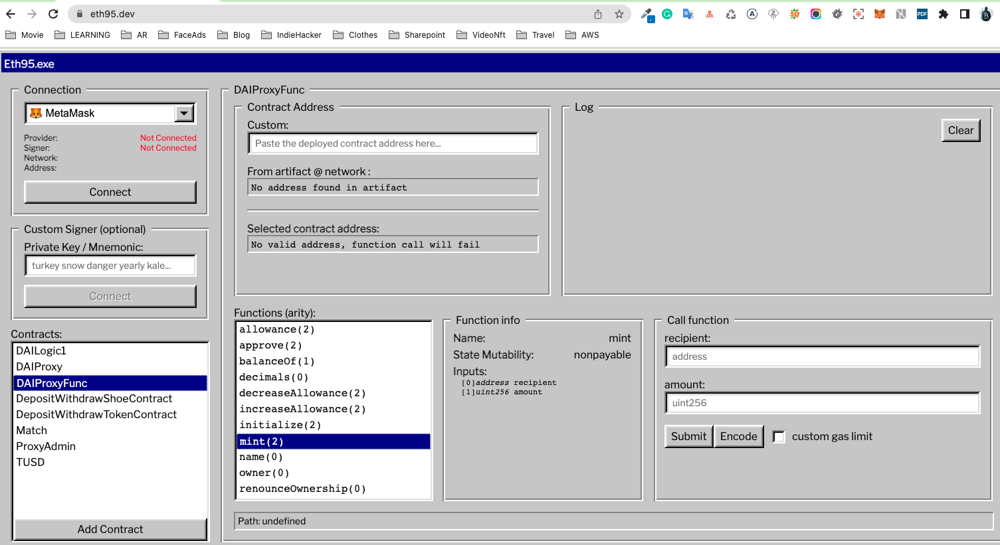
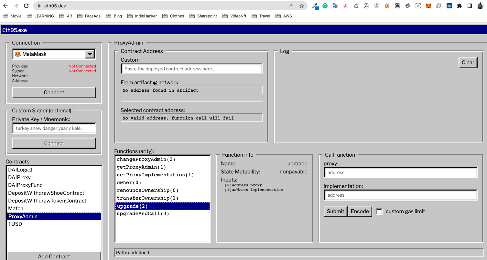

### Tools
    https://eth95.dev/
    https://remix.ethereum.org/

### Blog
    https://viblo.asia/p/lam-the-nao-de-upgrade-mot-smart-contract-tren-ethereum-phan-2-phan-cuoi-vyDZOqJG5wj

### Migrate use for deploy to blockchain

    truffle migrate --network bsctestnet
    truffle console --network bsctestnet

### Deployment step: 

## Go to file: 4_example_migration.js to deploy one by one 

    // Step 1: deploy DAIProxyAdmin
    // deployer.deploy(DAIProxyAdmin);

    // Step 2: deploy DAILogic1 and get info of this contract
    // deployer.deploy(DAILogic1);

    // Step 3: deploy DAILogic2 and get info of this contract
    // deployer.deploy(DAILogic2);

    // Step 4: deploy DAIProxy with param1 is address of DAILogic1, param2 is address of DAIProxyAdmin, param3 is data of DAILogic1,
    // param1 is address of DAILogic1: 0x1B3D68B686717e7F77FcAEe8551C5ccb55073bE7
    // param2 is address of DAILogic1: 0x829ff072beD98dAbDA16c2Be3F09cd7f2509a14e
    // param3 is data of DAILogic1,

    // let dai = await DAILogic1.at('0x1B3D68B686717e7F77FcAEe8551C5ccb55073bE7');
    // let data = await dai.contract.methods.initialize('DAI', 'DAI').encodeABI();
    // console.log(data)
    // await deployer.deploy(DAIProxy,'0x1B3D68B686717e7F77FcAEe8551C5ccb55073bE7','0x829ff072beD98dAbDA16c2Be3F09cd7f2509a14e',data);

    // Step 5: Go to https://eth95.dev/
    // test "mint" func when call to DAIProxy( forward to DAILogic1)

    // test "upgrade" func when call to DAIProxyAdmin to upgrade DAIProxy forward to DAILogic2

    // test "mint" func when call to DAIProxy( forward to DAILogic2) to see diff logic from this func

